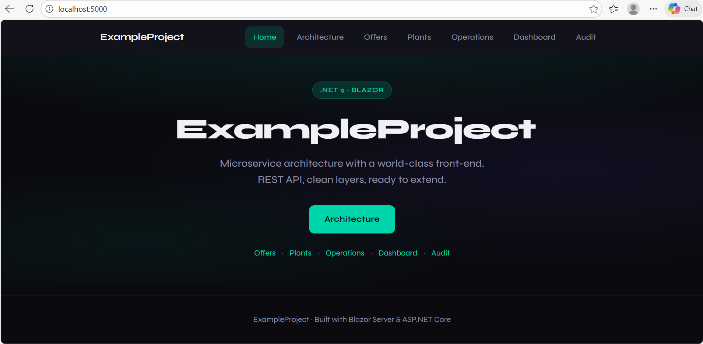

# ExampleProject

A .NET 9 microservice with a **Blazor** front-end and REST API in a single app. Built for clarity: layered (Core, Infrastructure, Api), tested, and runnable locally or in Docker.



## Features

- **Single app** — Blazor UI and API on one host (port 5000)
- **Layered design** — Core (domain), Infrastructure (persistence), Api (Blazor + endpoints)
- **Blazor Server** — Home, Overview, and Example tasks pages with shared navigation
- **REST API** — `/api` endpoint; extend with more routes as needed
- **Tests** — xUnit unit and integration tests (Core, Infrastructure, Api)
- **Docker** — Build and run in the background; stop with one script

## Tech stack

| Layer | Project | Role |
|-------|---------|------|
| API & UI | **ExampleProject.Api** | Blazor Server + minimal API (single host) |
| Domain | **ExampleProject.Core** | Entities, DTOs, interfaces |
| Data | **ExampleProject.Infrastructure** | Persistence, repositories |

**.NET 9** · **Blazor Server** · **xUnit** · **Docker**

## Prerequisites

- [.NET 9 SDK](https://dotnet.microsoft.com/download/dotnet/9.0)
- **Git** (for scripts; on Windows use **Git Bash**)
- **Docker** (optional, for containerized run)

## Quick start

**1. Clone and build**

```bash
git clone <repo-url>
cd ExampleProject
./scripts/build.sh
```

**2. Run the app**

```bash
./scripts/run.sh
```

Open **http://localhost:5000** — you’ll see the Blazor UI (home, Overview, Example tasks).

**3. Run tests**

```bash
./scripts/test.sh
```

**4. Run in Docker (background)**

```bash
./scripts/docker-run.sh
# Terminal is free. Stop when done:
./scripts/docker-stop.sh
```

## Scripts

Run from the repo root (use **Git Bash** on Windows).

| Script | Purpose |
|--------|--------|
| `scripts/build.sh` | Build the solution |
| `scripts/run.sh` | Run the app (GUI + API at http://localhost:5000) |
| `scripts/docker-run.sh` | Run the app in Docker (detached) |
| `scripts/docker-stop.sh` | Stop the Docker app |
| `scripts/test.sh` | Run all tests |
| `scripts/restore.sh` | Restore NuGet packages |
| `scripts/chmod-scripts.sh` | Make all scripts executable (run once after clone) |

First time: `chmod +x scripts/*.sh` or `bash scripts/chmod-scripts.sh`.

## Project structure

```
ExampleProject/
├── src/
│   ├── ExampleProject.Api/          # Blazor + API (entry point)
│   │   ├── Components/              # Blazor pages, layout, shared UI
│   │   ├── wwwroot/                 # Static assets (CSS)
│   │   └── Program.cs
│   ├── ExampleProject.Core/        # Domain entities, DTOs, interfaces
│   └── ExampleProject.Infrastructure/  # Persistence, repositories
├── tests/
│   ├── ExampleProject.Api.Tests/    # Integration tests
│   ├── ExampleProject.Core.Tests/   # Unit tests (Core)
│   └── ExampleProject.Infrastructure.Tests/
├── .github/workflows/
│   └── ci.yml                        # GitHub Actions: build, test, format, Docker
├── docs/
│   ├── images/                       # Screenshots (e.g. Frontend_GUI.png)
│   ├── CI.md                         # CI/CD description
│   └── README.md
├── scripts/                          # Build, run, test, Docker
├── docker-compose.yml
└── ExampleProject.sln
```

## Documentation

- **[docs/](docs/)** — Additional documentation and screenshots
- **docs/images/** — UI screenshots (e.g. front-end home page)

## Docker

The app runs in a single container. It listens on **8080** inside the container; docker-compose maps **5000:8080** so you use http://localhost:5000.

```bash
./scripts/docker-run.sh    # Build and start (detached)
./scripts/docker-stop.sh   # Stop
docker compose logs -f     # View logs
```

## Line endings (WSL)

If you see `$'\r': command not found` in WSL, fix scripts once:

```bash
sed -i 's/\r$//' scripts/*.sh
chmod +x scripts/*.sh
```

## License

Use as a learning or portfolio project as you see fit.
